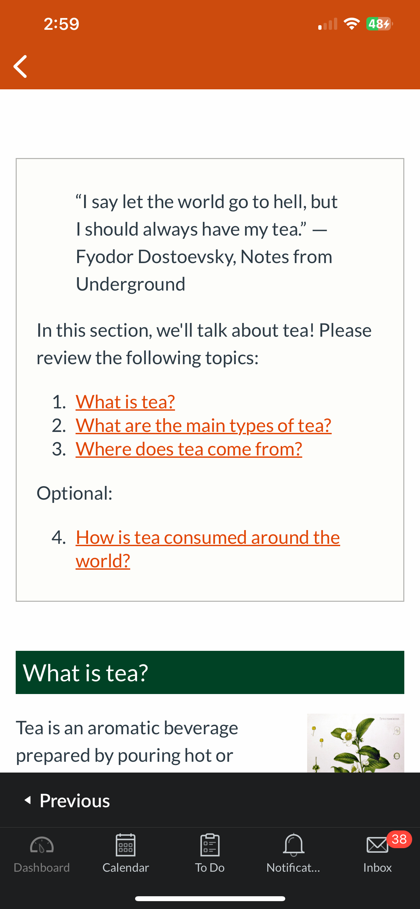
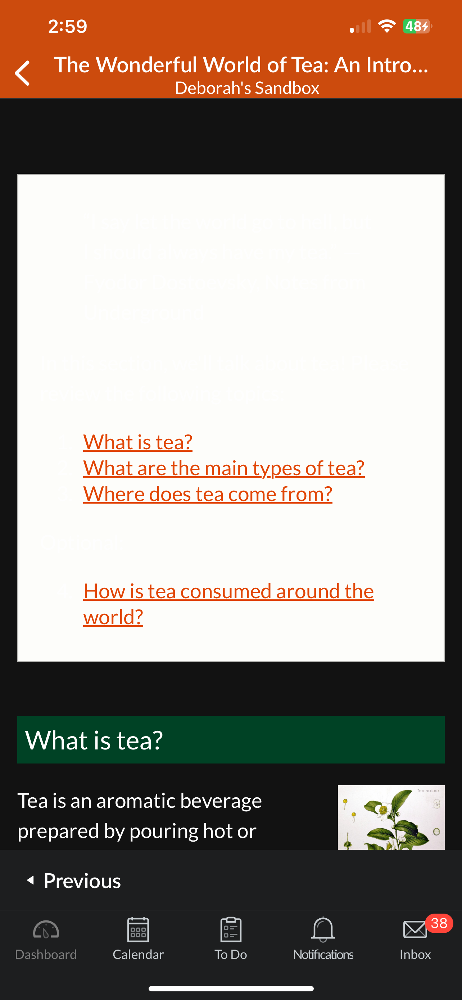

# Would this page look good on a mobile?

## Dark Mode Consideration

Canvas applications for Android and iOS support dark themes. The dark mode option was implemented to accommodate light-sensitive users, those who read in the evening, or who prefer the dark mode appearance.
Dark mode may present challenges when styling Canvas content. Canvas default colors change in dark mode. By default, dark text becomes white.
The blockquote at the top of our Wonderful World of Tea page was styled with 'background-color: #fefefa`, a very light grey color. Without changing the blockquote font color, that page would look like this in the Canvas Mobile app in the light mode:

### Light Mode
<!--  -->

  <figure style="width: 40%; float: left; margin: 0 30px 10px 0;"></figure>

### Dark Mode
However, if a user has the Canvas Mobile running in dark mode, the page would look like this:



Because the text turns white in dark mode, it is difficult or impossible to read text against a light background.

### Simple Fix

By specifying a dark color on white backgrounds:

```html
    <div style="color: #2d3b45; background-color: #fefefa; border: 1px solid #b2b2af; padding: 10px 20px 10px 20px;">
        <blockquote>...</blockquote>
        ...
    </div>
```

This style attribute on the div, `color:#2d3b45;`, is telling Canvas to use a dark grey for the text in the container, rather than inherit the default dark mode font color:


You may also notice that the text below the blockquote box, "Tea is an aromatic beverage..." is white. This is the default behavior. No text color was specified for these paragraphs: `<p>Tea is an aromatic beverage... </p>`
